## Part 1. Инструмент ipcalc (поднять виртуальную машину -- ws1)
- Установил Ubuntu 20.04 Server LTS 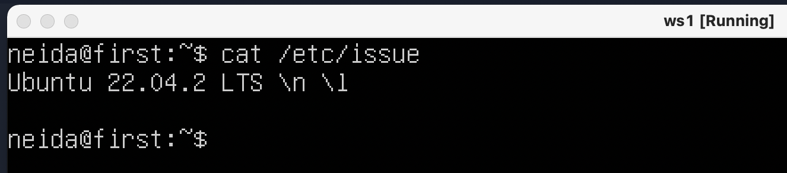
### 1.1 Сети и маски 
- **1)** Адрес сети 192.167.38.54/13
    > Скачали утилиту ipcalc с помощью команды `sudo apt install ipcalc` и после ввел команду `ipcalc -b 192.167.38.54/13`, где флаг `-b` подавляет поразрядный вывод. 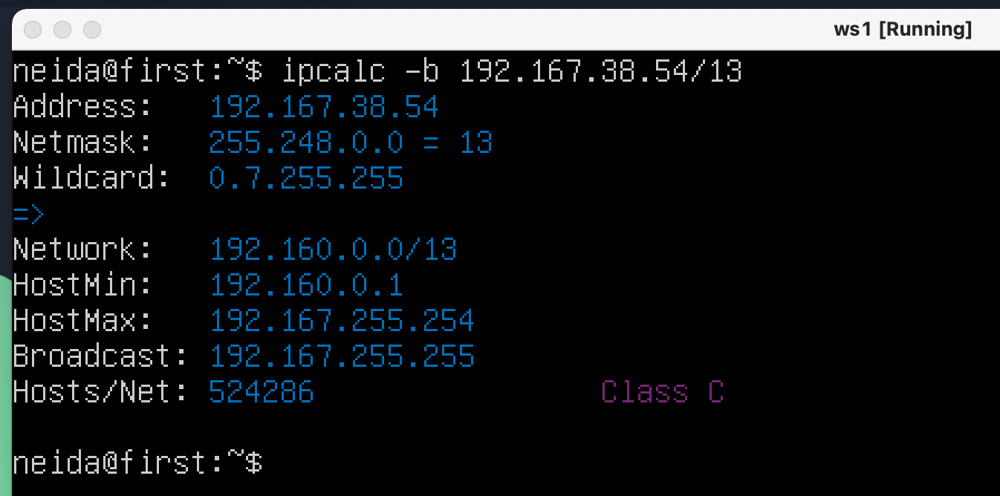
- **2)** Перевод маски 255.255.255.0 в префиксную и двоичную запись, /15 в обычную и двоичную, 11111111.11111111.11111111.11110000 в обычную и префиксную
    > Что бы узнать двоичную, десятичную или префиксную запись маски, достаточно уметь переводить числа из двоичной в десятичную и обратно. А префиксная запись маски - это запись её длины в битах, т.е число от 0 до 32. 
    * 255.255.255.0
        > Ввел команду `ipcalc 255.255.255.0`. 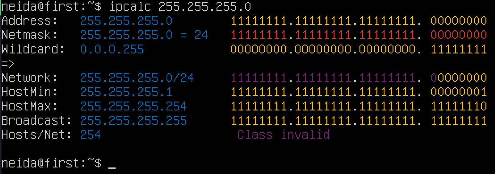
        Где префиксная запись - это `/24`, а двоичная запись -  `11111111.11111111.1111111. 00000000`
    * /15
        > Ввел команду `ipcalc /15`. 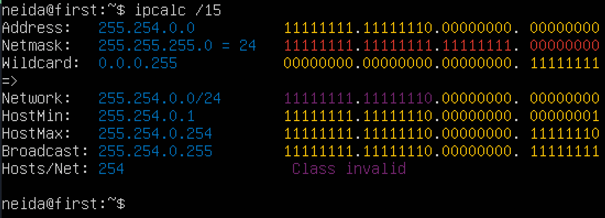
        Где обычная запись это `255.254.0.0`, а двоичная запись - `11111111.11111110.00000000. 00000000`
    * 11111111.11111111.11111111.11110000
        > Перевел в десятичную запись, а также префиксную, так как `ipcalc` не способен считывать двоичную запись в качесьве ввода, а затем проверил их введя команды `ipcalc /28` и `ipcalc 255.255.255.240`.Префиксная запись будет такой: `/28`, а обычная запись - `255.255.255.240` 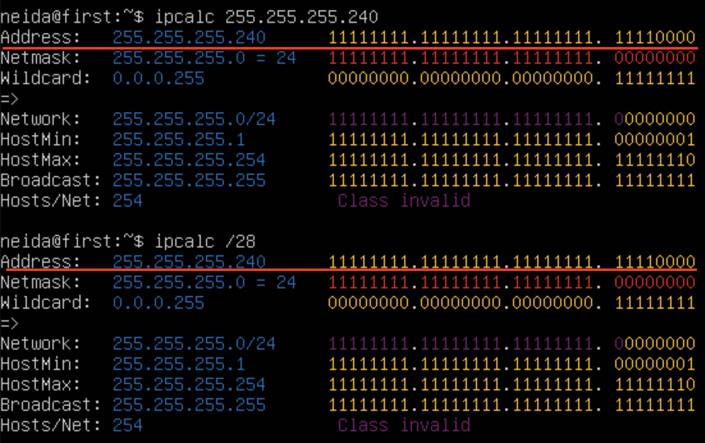
- **3)** минимальный и максимальный хост в сети 12.167.38.4 при масках: /8, 11111111.11111111.00000000.00000000, 255.255.254.0 и /4
    * 12.167.38.4/8. Ввел команду `ipcalc 12.1677.38.4/8`
        > - MIN хост: `12.0.0.1`
        > - MAX хост: `12.255.255.254`
        > 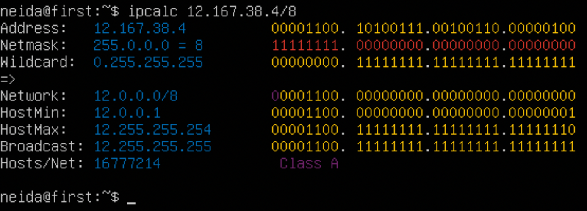
    * 12.167.38.4 при маске 11111111.11111111.00000000.00000000 (/16, верность этого можно будет проверит в строке `Netmask` следующей команды). Ввел команду `ipcalc 12.167.38.4/16`
        > - MIN хост: `12.167.0.1`
        > - MAX хост: `12.167.255.254`
        > 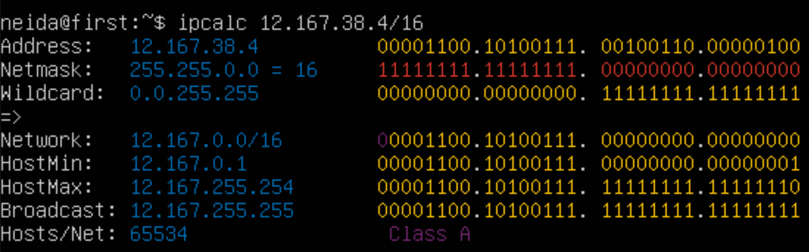
    * 12.167.38.4 при маске 255.255.254.0. Ввел команду `ipcalc 12.167.38.4/255.255.254.0`
        > - MIN хост: `12.167.38.1`
        > - MAX хост: `12.167.39.254`
        > 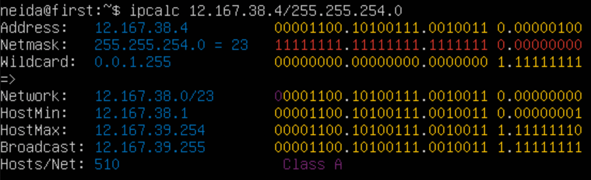
    * 12.167.38.4 при маске /4. Ввел команду `ipcalc 12.167.38.4/4`
        > - MIN хост: `0.0.0.1`
        > - MAX хост: `15.225.255.254`
        > 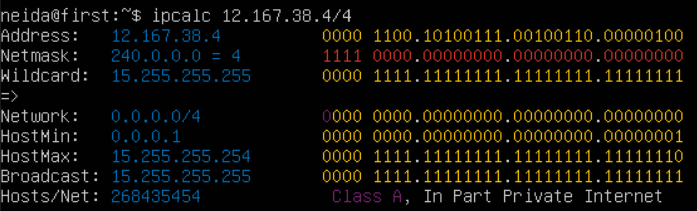
### 1.2 localhost
* Определить и записать в отчёт, можно ли обратиться к приложению, работающему на localhost, со следующими IP: 194.34.23.100, 127.0.0.2, 127.1.0.1, 128.0.0.1
    > Для localhost зарезервирован диапазон ip адресов от 127.0.0.1 до 127.255.255.254 включительно, следовательно
    - 194.34.23.100 - ***НЕЛЬЗЯ***
    - 127.0.0.2 - ***МОЖНО***
    - 127.1.0.1 - ***МОЖНО***
    - 128.0.0.1 - ***НЕЛЬЗЯ***
    > Это можно проверить с помощью команды `ipcalc`:
    > * для ip 194.34.23.100 вывод таков: 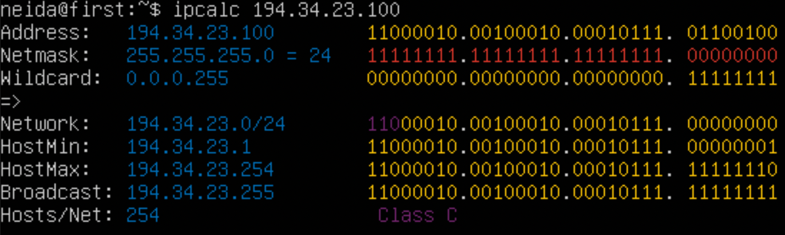 В строке `Host/Net` отсутствует надпись `Loopback`, это указывает на то, что ***НЕЛЬЗЯ*** обратиться к приложению, работающему на lockalhost с таким IP.
    > * для ip 127.0.0.2: 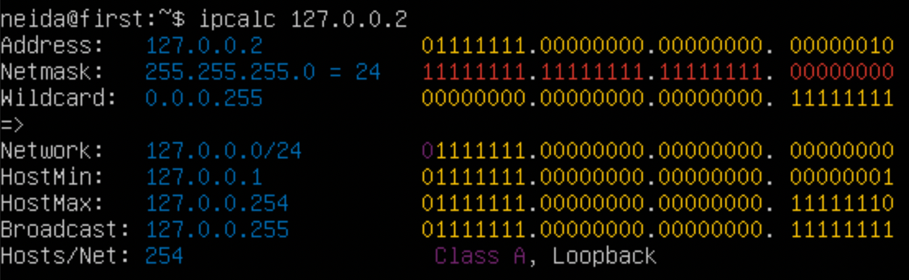 В строке `Host/Net` есть надпись `Loopback`, следовательно ***МОЖНО***.
    > * для ip 127.1.0.1: 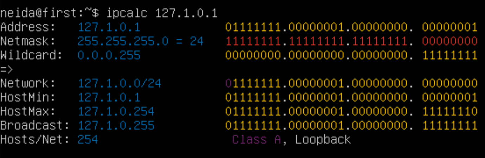 В строке `Host/Net` есть надпись `Loopback`, следовательно ***МОЖНО***.
    > * для ip 128.0.0.1: 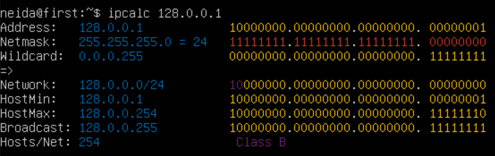 В строке `Host/Net` отсутствует надпись `Loopback`, следовательно ***НЕЛЬЗЯ***.

### 1.3. Диапазоны и сегменты сетей
* **1)** какие из перечисленных IP можно использовать в качестве публичного, а какие только в качестве частных: 10.0.0.45, 134.43.0.2, 192.168.4.2, 172.20.250.4, 172.0.2.1, 192.172.0.1, 172.68.0.2, 172.16.255.255, 10.10.10.10, 192.169.168.1
    > - Для того, чтобы понять, можно ли использовать в качестве публичного IP перечилсенные выше, воспользуемся командой `ipcalc <IP>`. Если в строке `Host/Net` есть надпись `Private Internet`,то можно, иначе - нельзя.
    > Вывод команды `ipcalc <IP>`:
    >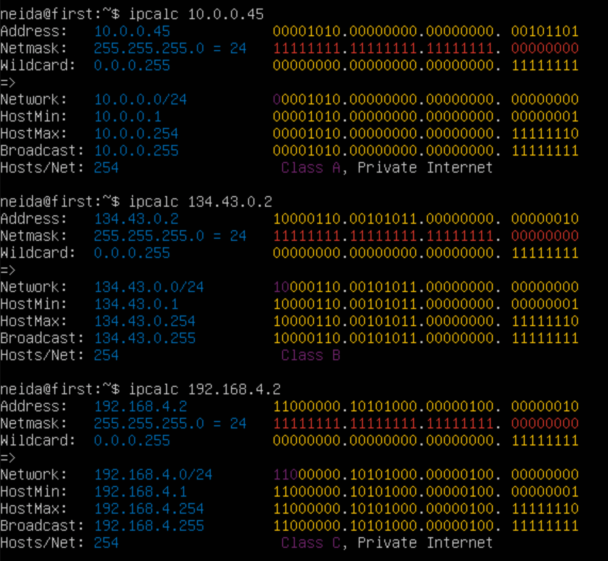
    >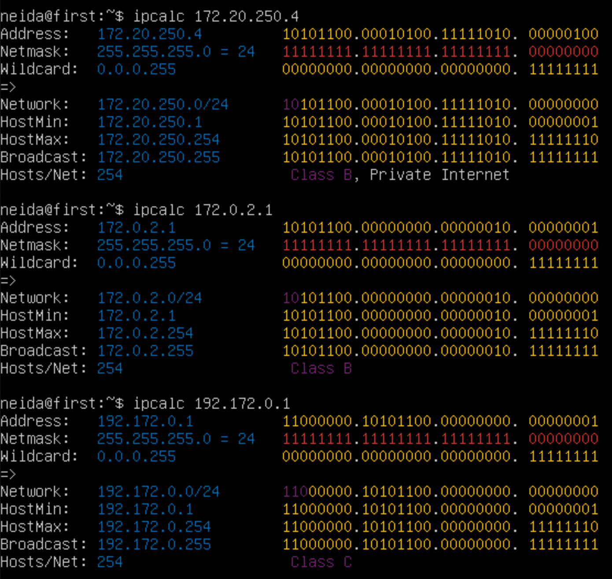
    >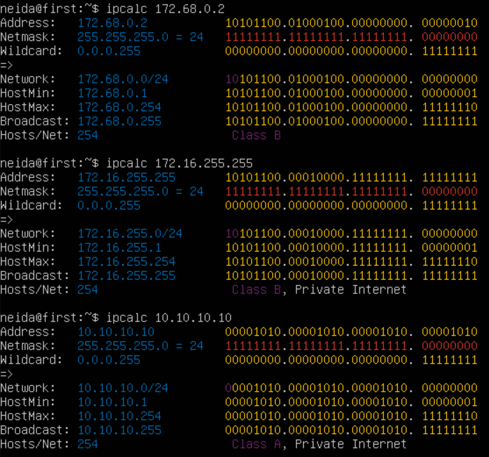
    >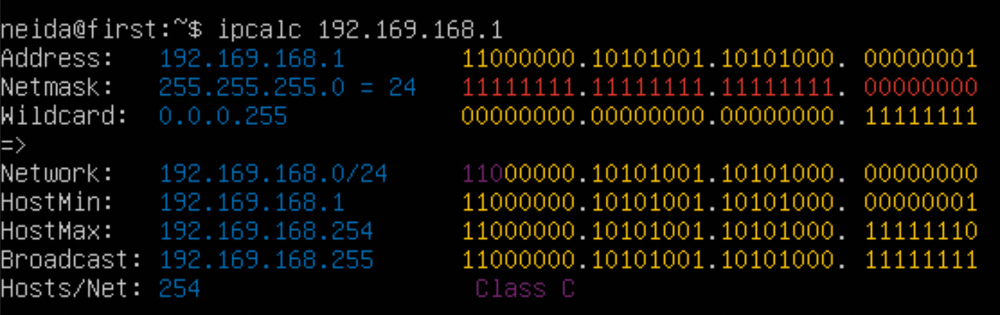
    - Результат:
        * 10.0.0.45 - ***МОЖНО***
        * 134.43.0.2 - ***НЕЛЬЗЯ***
        * 192.168.4.2 - ***МОЖНО***
        * 172.20.250.4 - ***МОЖНО***
        * 172.0.2.1 - ***НЕЛЬЗЯ***
        * 192.172.0.1 - ***НЕЛЬЗЯ***
        * 172.68.0.2 - ***НЕЛЬЗЯ***
        * 172.16.255.255 - ***МОЖНО***
        * 10.10.10.10 - ***МОЖНО***
        * 192.169.168.1 - ***НЕЛЬЗЯ***
* **2)** какие из перечисленных IP адресов шлюза возможны у сети 10.10.0.0/18: 10.0.0.1, 10.10.0.2, 10.10.10.10, 10.10.100.1, 10.10.1.255
    > - С помощью команды `ipcalc 10.10.0.0/18` можно определить какие ip адреса возможны
    > - Результат выполнения команды: 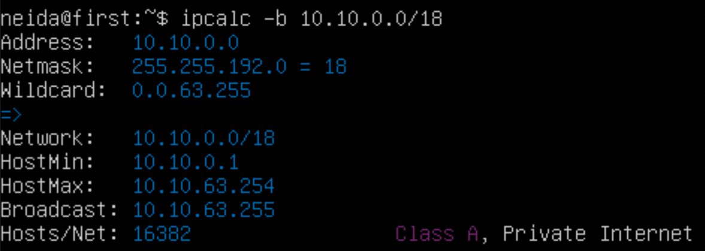 Все IP, что входят в диапазон от min до max хостов, возможны.
    - Результат:
        * 10.0.0.1 - ***НЕВОЗМОЖЕН***
        * 10.10.0.2 - ***ВОЗМОЖЕН***
        * 10.10.10.10 - ***ВОЗМОЖЕН***
        * 10.10.100.1 - ***НЕВОЗМОЖЕН***
        * 10.10.1.255 - ***ВОЗМОЖЕН***
## Part 2. Статическая маршрутизация между двумя машинами
- Поднял две виртуальные машины
- Вызов и вывод команды `ip a` на обех машинах: 
>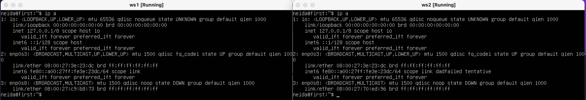
- Описал сетевой интерфейс, соответствующий внутренней сети, на обеих машинах и задал следующие адреса и маски: ws1 - 192.168.100.10, маска /16, ws2 - 172.24.116.8, маска /12 (скриншот ниже вместе со следующим пунктом)
- Выполнил команду `sudo netplan apply` 
    * для ***первой*** машины и для ***второй*** машины 
    >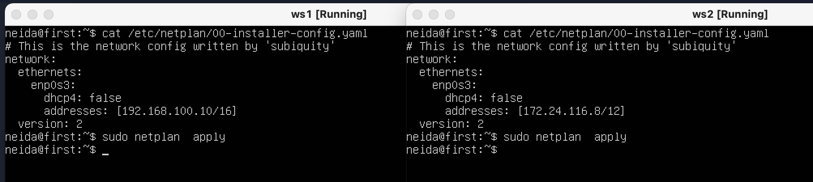
- ***2.1.*** Добавление статического маршрута вручную
    * Добавить статический маршрут от одной машины до другой и обратно при помощи команды `ip r add 172.24.116.8 dev enp0s3` для ws1 и `ip r add 192.168.100.10 dev enp0s3` для ws2.
    * Пропинговал соединение между машинами с помощью команд `ping 172.24.116.8 -c 20` и `ping 192.168.100.10 -c 20`
    >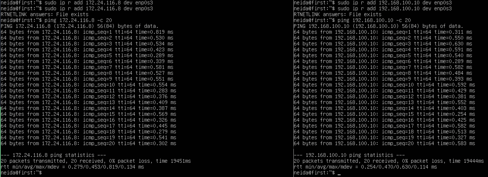
- ***2.2.*** Добавление статического маршрута с сохранением
    * Перезапустил машины с помощью команды `reboot`
    * Добавил статический маршрут от одной машины до другой с помощью файла etc/netplan/00-installer-config.yaml 
    >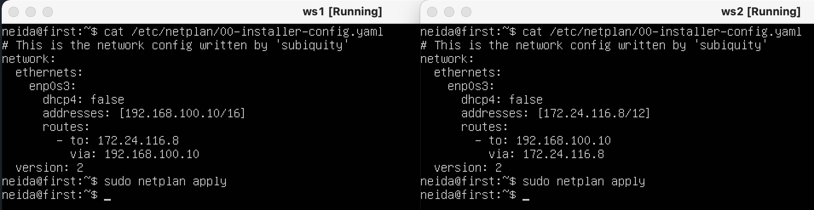
    * Пропинговал соединение между машинами с помощью команд `ping 172.24.116.8 -c 20` и `ping 192.168.100.10 -c 20`
    >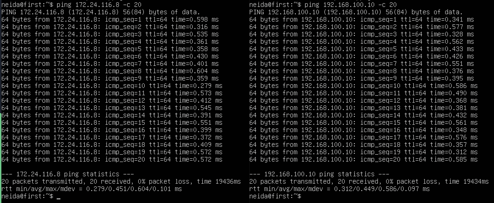
## Part 3. Утилита iperf3
- ***3.1.*** Скорость соединения (Перевести и записать в отчёт: 8 Mbps в MB/s, 100 MB/s в Kbps, 1 Gbps в Mbps)
    * 8 Mbps = 1 MB/s  
    * 100 MB/s = 819200 Kbps  
    * 1 Gbps = 1024 Mbps
- ***3.2.*** Утилита iperf3 (Измерить скорость соединения между ws1 и ws2)
    >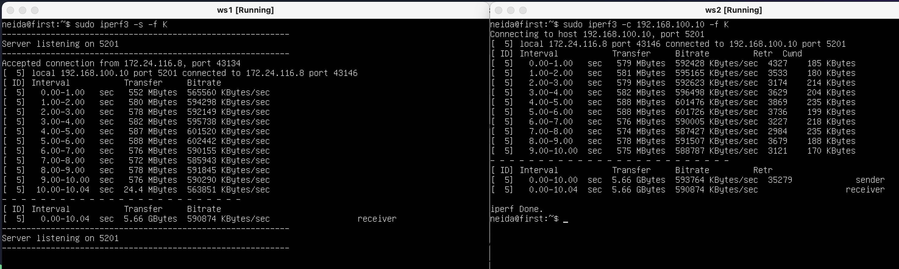
## Part 4. Сетевой экран
- ***4.1.*** Утилита iptables
    * Создать файл /etc/firewall.sh, имитирующий фаерволл, на ws1 и ws2
    * Нужно добавить в файл подряд следующие правила:
        - 1) на ws1 применить стратегию когда в начале пишется запрещающее правило, а в конце пишется разрешающее правило (это касается пунктов 4 и 5)
        - 2) на ws2 применить стратегию когда в начале пишется разрешающее правило, а в конце пишется запрещающее правило (это касается пунктов 4 и 5)
        - 3) открыть на машинах доступ для порта 22 (ssh) и порта 80 (http)
        - 4) запретить echo reply (машина не должна "пинговаться”, т.е. должна быть блокировка на OUTPUT)
        - 5) разрешить echo reply (машина должна "пинговаться")
    >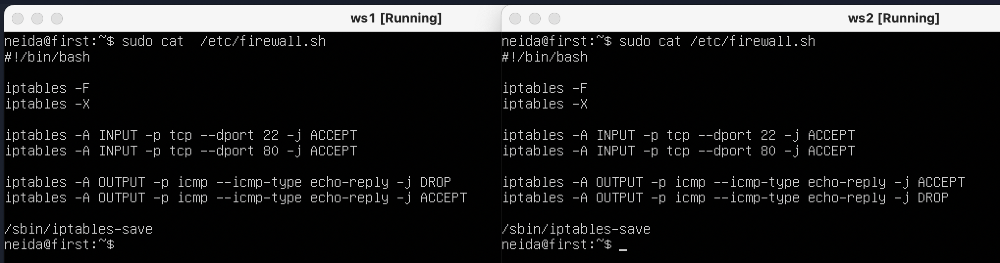
    * Запустить файлы на обеих машинах командами `chmod +x /etc/firewall.sh` и `/etc/firewall.sh`
    >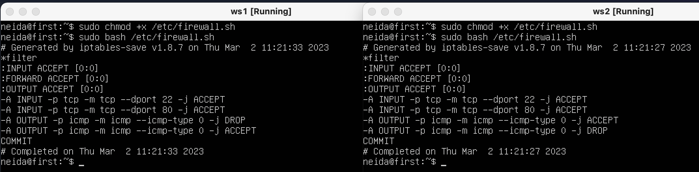
- ***4.2.*** Утилита nmap
    * Командой ping найти машину, которая не "пингуется", после чего утилитой nmap показать, что хост машины запущен
    >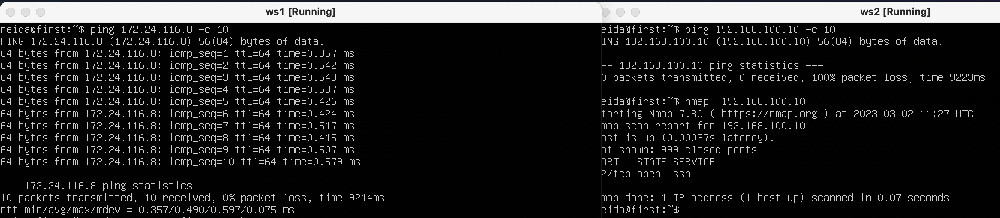
    > Из скрина видно, что хоть хост машины `ws1` и запущен, однако не пингуется 
    * Сохранить дампы образов виртуальных машин
## Part 5. Статическая маршрутизация сети
- Поднять пять виртуальных машин (3 рабочие станции (ws11, ws21, ws22) и 2 роутера (r1, r2))
- ***5.1.*** Настройка адресов машин
    * Настроить конфигурации машин в `etc/netplan/00-installer-config.yaml` согласно сети на рисунке.
    
    > Результат:
    > 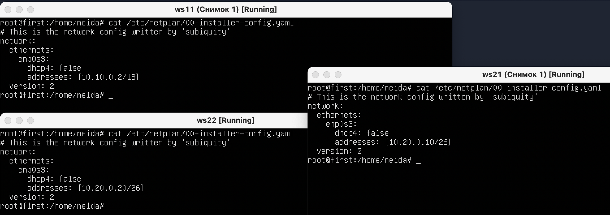
    > 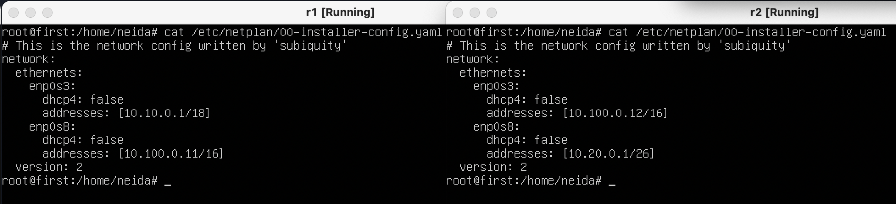
    * Перезапустить сервис сети. Если ошибок нет, то командой ip -4 a проверить, что адрес машины задан верно. Также пропинговать ws22 с ws21. Аналогично пропинговать r1 с ws11.
    > Результат:
    > 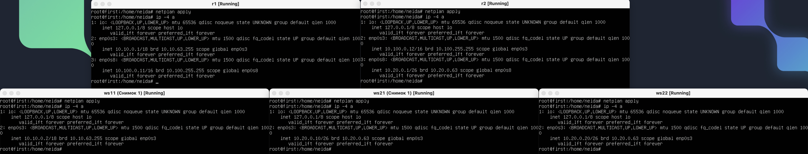
    > 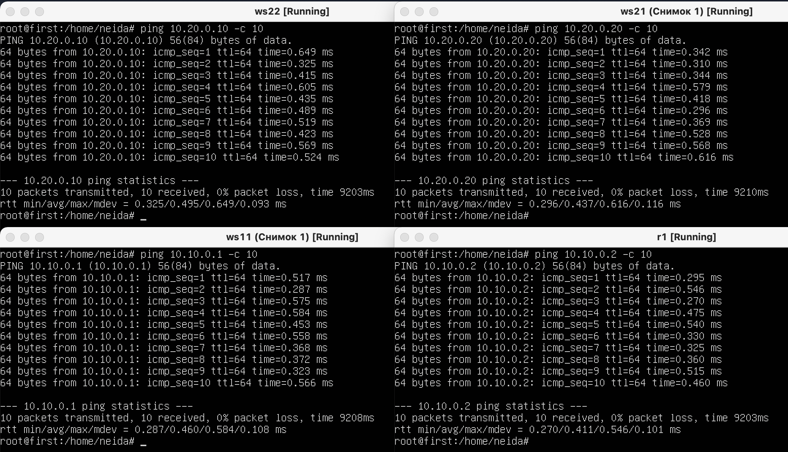
- ***5.2.*** Включение переадресации IP-адресов.
    * Для включения переадресации IP, выполните команду на роутерах: `sysctl -w net.ipv4.ip_forward=1`
    > При таком подходе переадресация не будет работать после перезагрузки системы.
    > 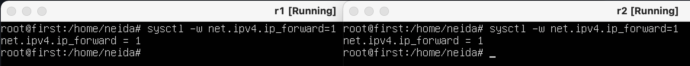
    * Откройте файл /etc/sysctl.conf и добавьте в него следующую строку: `net.ipv4.ip_forward = 1`
    > При использовании этого подхода, IP-переадресация включена на постоянной основе.
    > Результат:
    > 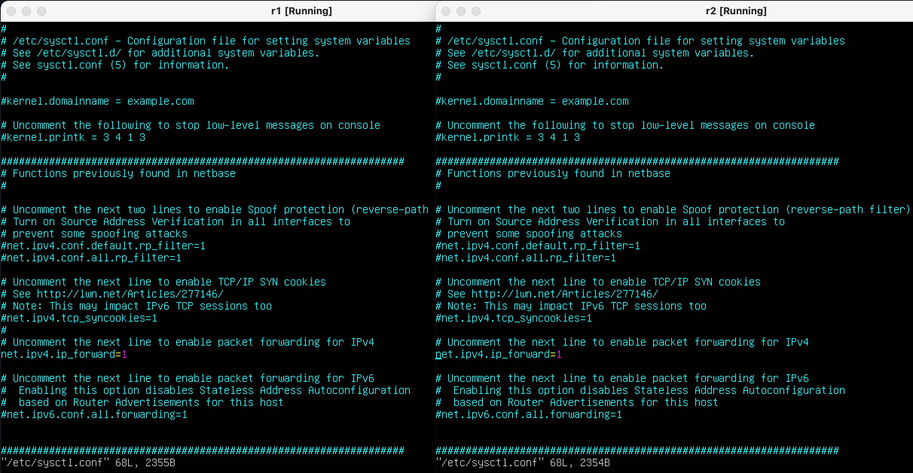
- ***5.3.*** Установка маршрута по-умолчанию
    * Пример вывода команды ip r после добавления шлюза:
    ```
    default via 10.10.0.1 dev eth0
    10.10.0.0/18 dev eth0 proto kernel scope link src 10.10.0.2
    ```
    > 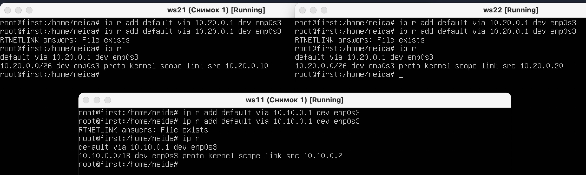
    * Настроить маршрут по-умолчанию (шлюз) для рабочих станций. Для этого добавить default перед IP роутера в файле конфигураций (скриншот ниже)
    * Вызвать ip r и показать, что добавился маршрут в таблицу маршрутизации
    > 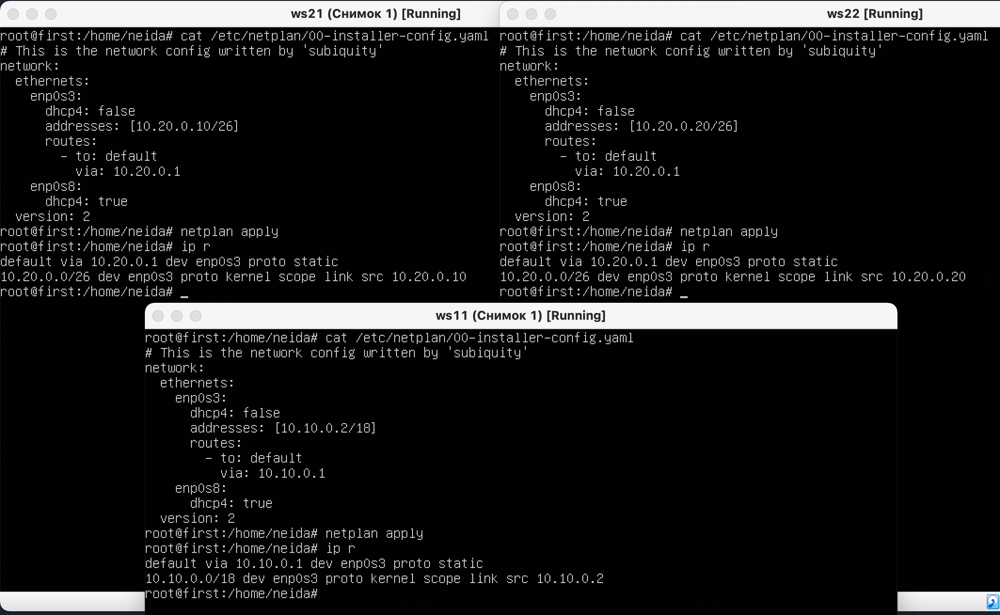
    * Пропинговать с ws11 роутер r2 и показать на r2, что пинг доходит. Для этого использовать команду: `tcpdump -tn -i eth1`
    > 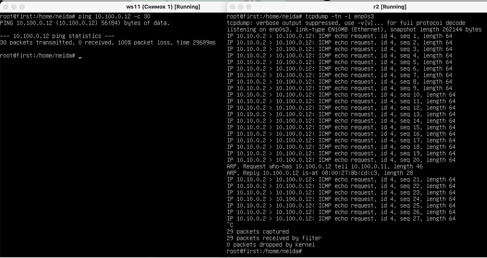
- ***5.4.*** Добавление статических маршрутов
    * Добавить в роутеры r1 и r2 статические маршруты в файле конфигураций. Пример для r1 маршрута в сетку 10.20.0.0/26
    * Вызвать ip r и показать таблицы с маршрутами на обоих роутерах.
    > 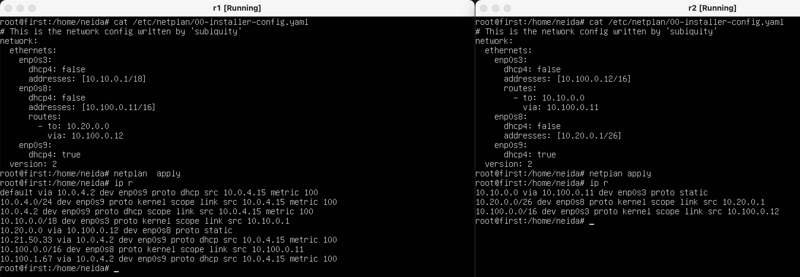
    * Запустить команды на ws11
    > 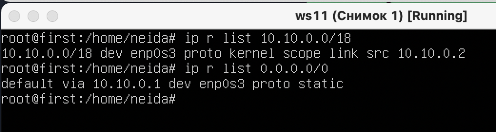
    > Маршрут подбирается по таблице марштрутизаторов. Если маршрут выбран успешно то он будет передан. Если не успешно - пакет не будет передан. Если несколько совпадений - то для переадсресации будет выбран маршрут с самой длинной маской.
- ***5.5.*** Построение списка маршрутизаторов
    * Запустить на r1 команду дампа `tcpdump -tnv -i enp0s3`
    > 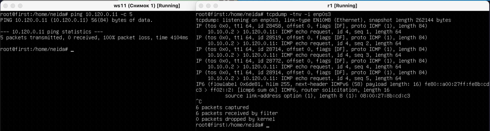
    * При помощи утилиты traceroute построить список маршрутизаторов на пути от ws11 до ws21
    > 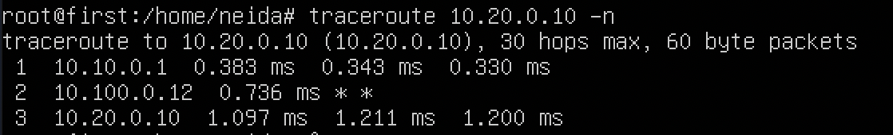
    > 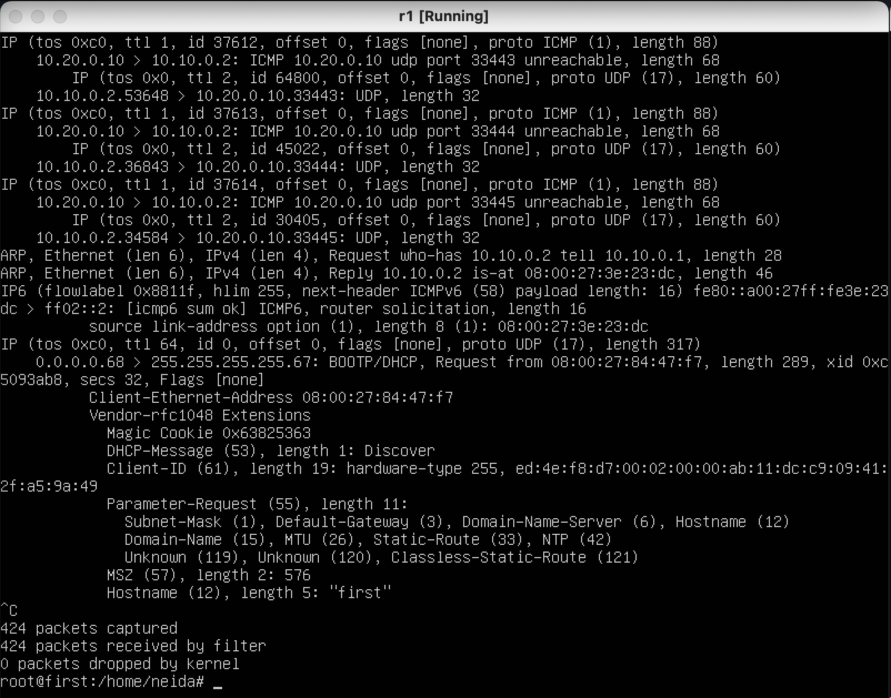
- ***5.6.*** Использование протокола ICMP при маршрутизации
    * Запустить на r1 перехват сетевого трафика, проходящего через eth0 с помощью команды `tcpdump -n -i eth0 icmp`
    * Пропинговать с ws11 несуществующий IP (например, 10.30.0.111) с помощью команды `ping -c 1 10.30.0.111`
    > 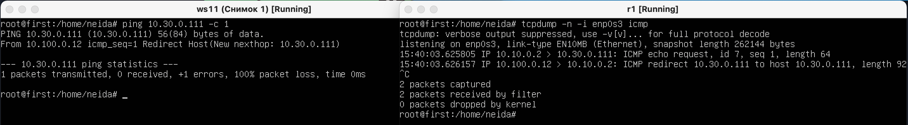
    * Сохранить дампы образов виртуальных машин
## Part 6. Динамическая настройка IP с помощью DHCP
-  Для r2 настроить в файле /etc/dhcp/dhcpd.conf конфигурацию службы DHCP:
    * 1) указать адрес маршрутизатора по-умолчанию, DNS-сервер и адрес внутренней сети. Пример файла для r2:
    ```
    subnet 10.100.0.0 netmask 255.255.0.0 {}

    subnet 10.20.0.0 netmask 255.255.255.192
    {
        range 10.20.0.2 10.20.0.50;
        option routers 10.20.0.1;
        option domain-name-servers 10.20.0.1;
    }
    ```
    > 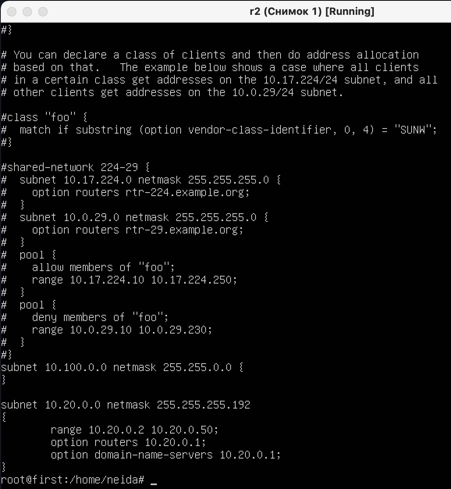
    * 2) в файле resolv.conf прописать nameserver 8.8.8.8.
    > 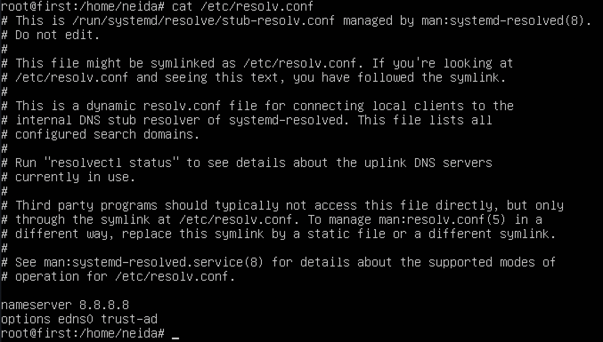
- Перезагрузить службу DHCP командой systemctl restart isc-dhcp-server. Машину ws21 перезагрузить при помощи reboot и через ip a показать, что она получила адрес. Также пропинговать ws22 с ws21.
> 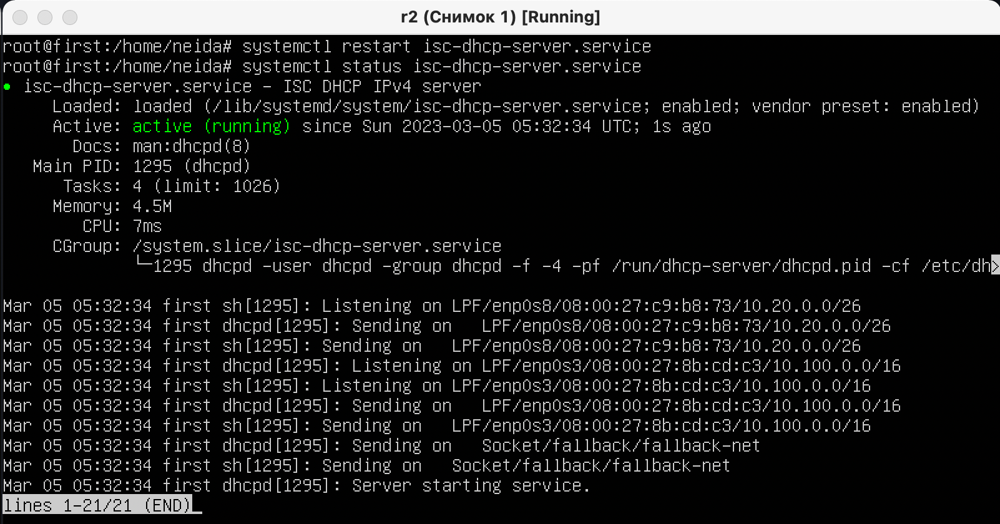
> 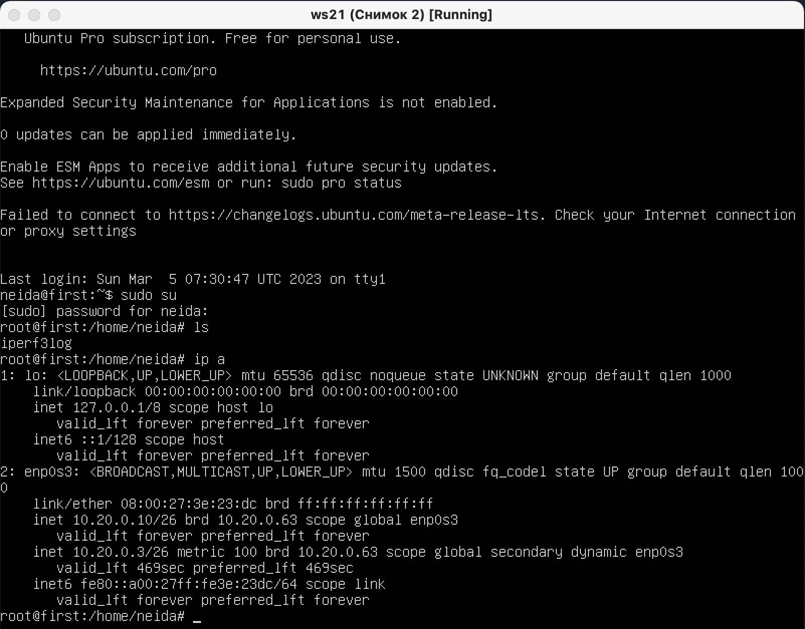
> 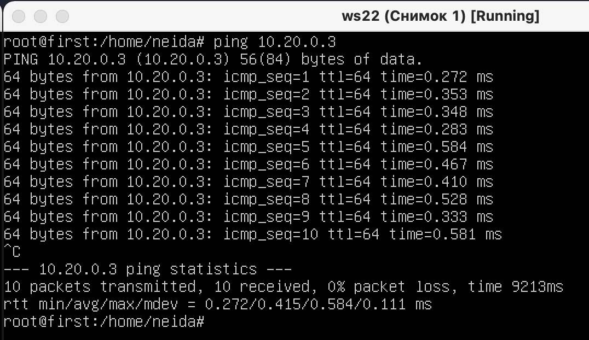
- Указать MAC адрес у ws11, для этого в etc/netplan/00-installer-config.yaml надо добавить строки: macaddress: 10:10:10:10:10:BA, dhcp4: true
> 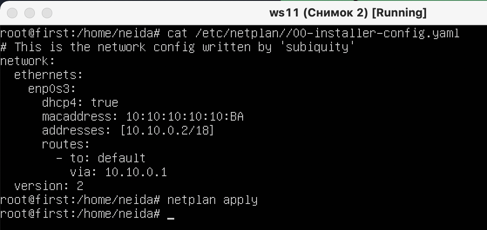
- Для r1 настроить аналогично r2, но сделать выдачу адресов с жесткой привязкой к MAC-адресу (ws11). Провести аналогичные тесты
> 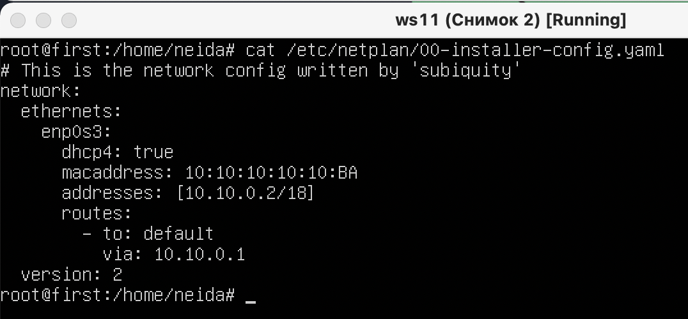
> 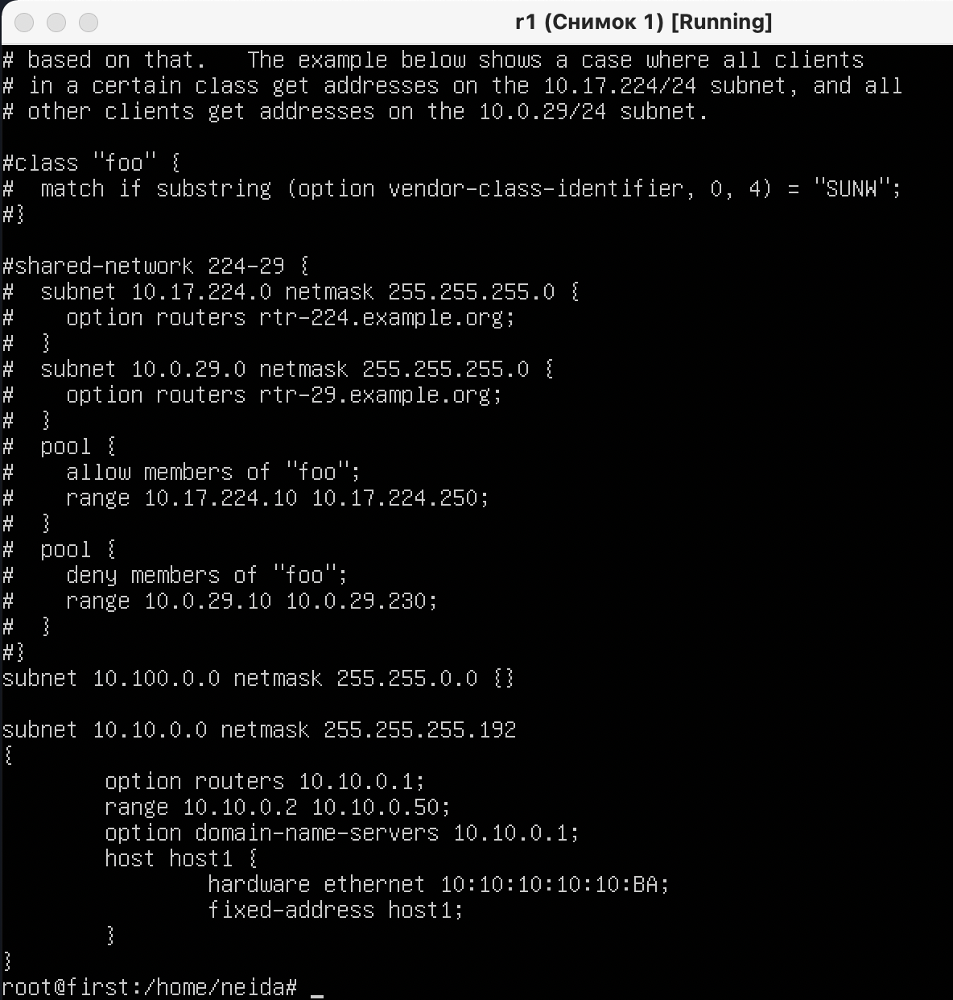
> 
> 
> 
- Запросить с ws21 обновление ip адреса с помощью команды `dhclient -r` (удаление динамического ip) и `dhclient` (для присваивания нового динамического ip)
> 
## Part 7. NAT
- В файле /etc/apache2/ports.conf на ws22 и r1 изменить строку Listen 80 на Listen 0.0.0.0:80, то есть сделать сервер Apache2 общедоступным
- Запустить веб-сервер Apache командой service apache2 start на ws22 и r1
> 
> 
- Добавить в фаервол, созданный по аналогии с фаерволом из Части 4, на r2 следующие правила:
    * 1) удаление правил в таблице filter - iptables -F
    * 2) удаление правил в таблице "NAT" - iptables -F -t nat
    * 3) отбрасывать все маршрутизируемые пакеты - iptables --policy FORWARD DROP
> 
- Запускать файл также, как в Части 4
> 
- Проверить соединение между ws22 и r1 командой ping
> 
- Добавить в файл ещё одно правило:
    * 4) разрешить маршрутизацию всех пакетов протокола ICMP

- Запускать файл также, как в Части 4
> 
- Проверить соединение между ws22 и r1 командой ping
> 
- Добавить в файл ещё два правила:
    * 5) включить SNAT, а именно маскирование всех локальных ip из локальной сети, находящейся за r2 (по обозначениям из Части 5 - сеть 10.20.0.0)
    * 6) включить DNAT на 8080 порт машины r2 и добавить к веб-серверу Apache, запущенному на ws22, доступ извне сети
> 
- Запускать файл также, как в Части 4
> 
- Проверить соединение по TCP для SNAT, для этого с ws22 подключиться к серверу Apache на r1
> 
- Проверить соединение по TCP для DNAT, для этого с r1 подключиться к серверу Apache на ws22 командой telnet (обращаться по адресу r2 и порту 8080)
- Сохранить дампы образов виртуальных машин

